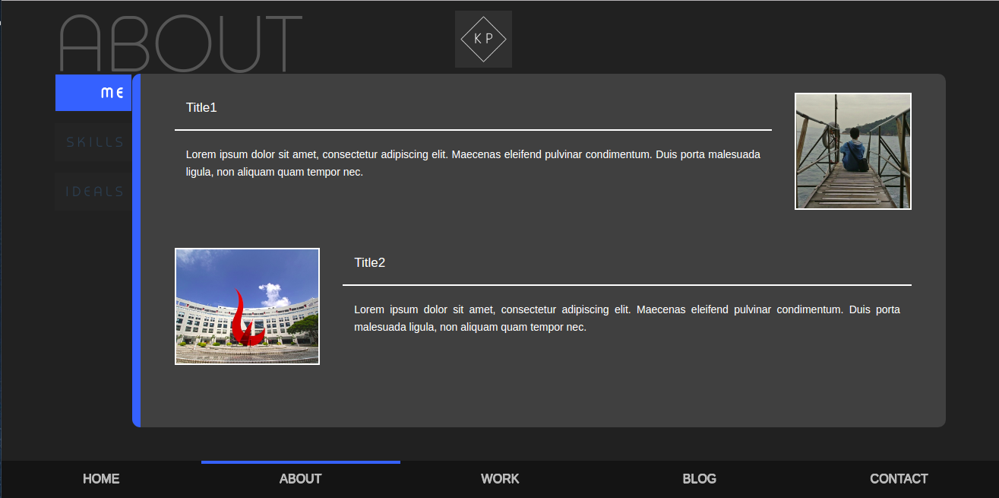
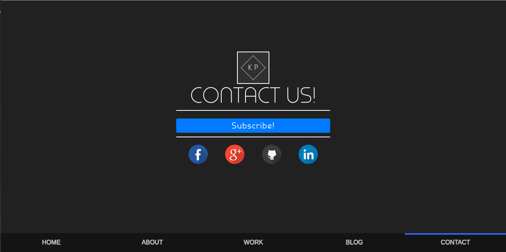
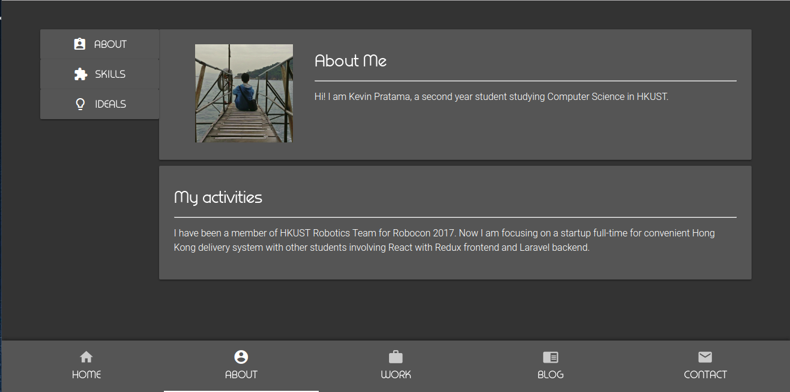

# Project 1 Diary - Personal Portfolio Site

## Part 1 - Designing Mockups
---

The mockup design was made using the website draw.io. Initially I wanted to do a rough sketch up, using the default size of the mockup. Then I decided to do multiple screens for the mockup itself, showing every possible state screen of my website. I thought that providing multiple screens allow for side-by-side comparisons, and reviewing my website would be easier by looking directly at other screens of the web.

For the design itself, I planned to make five tabs within a navigation bar. I liked the idea from several websites that have pinned navigation on top or on bottom of the page, allowing for easy screen switching by just tapping the buttons. As seen from the first to the second picture, I made the navigation tabs cover the whole bottom part of the screen. The result doesn't only look nicer, but also provides clear layout segmentations for the web.

For the content itself, I had this one idea of making the screens symmetrical. Assume that the five screens are numbered 1, 2, 3, 4, 5. Screen 1 is similar to 5, screen 2 is similar to 4, and screen 3 has its own design. This idea came to mind that I wanted to make a smooth transition for the users navigating from the least-content page (screen 1), to content-heavy page (screen 3), and back to least-content page (screen 5).

Content-wise, I want to keep the text short but providing important information. That's why I used panels and on-screen pages rather than scrolling so that people can actually focus on what's displayed on the screen. Most of the content will be delivered in points, short sentences, and phrases.

## Part 2 - Building the Website
---

The website was initially built with Vue.JS, a modular/component-based JavaScript framework. I was also trying the framework for the first time, so it's more like building and learning on-the-go. The website is also bundled with HTML markups and CSS decorations.

I was able to mimic and follow the mockup design during the early development stages. Most of the designs were the same. In the mockup, I wasn't able to find a component for tree-view navigation, so I ended up in having a different design for tree view. However, the implementation design is what I wanted for the website.

The subscribe button also changed to the current mockup, as a button since it would be easier to click rather than type, especially in mobile phones.

Other design decisions include the navigation panel on the left side in About page (screen 2) to easily navigate to sub-content of the page. Work page (screen 3) was implemented with a rather similar design with content-changing buttons, except they were placed in a progress bar. This was done purposely in a way users can experience a timeline-like view with each of my work/projects categorized in each year.

## Part 3 - Mobile Compatibility & Revisions
---

> Messy components in mobile view. Implemented before moving on to Quasar

The major problem I was facing was how incompatible the early implementation was when I opened it from a mobile phone. The blog page (screen 4) was so cluttered an very unreadable.

Another major concern that I had to deal with was the content readibility. If I set the content to be readable in PC screen, it would be too small in mobile views as shown in the pictures. And if I set the text to be readable in mobile view, it will be too small/big in PC views. Having the content too large may also lead to content overflowing problems.

> Final design in Web view, with Quasar Framework

> Now added with mobile view compatibility

Hence, I went with Quasar Framework as the hybrid Web/Mobile UI wrapper for the website, with Vue.JS still as the Frontend Framework. Many of the problems were solved using Quasar Framework. I implemented the navigation bars at the bottom in just a matter of minutes, and resolved the content overflow easily. I then decided to enable page-scrolling for mobile views, while keeping the content short as to avoid long scrolls for the users. I still kept the on-screen page design for PC and web browsers for easy viewing.

The major change upon using Quasar, is that I had to change the tree view navigation in blog page (screen 4) as it kept blocking the content in mobile views. The tree view navigation was then changed to the buttons similar in About page (screen 2). The buttons were also reduced to three to enable compatibility on mobile views, and for easy/uncluttered content.
