# Project 2 Diary - Redesigning Light

## Part 1 - Needfinding
---

[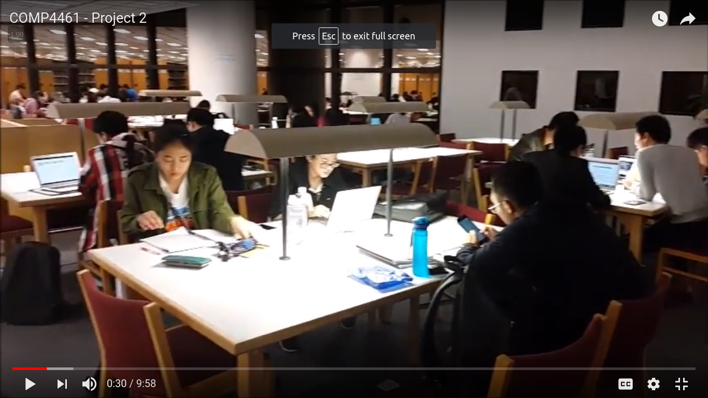](https://kp-kepra.github.io/comp4461diary/p2/observe1.png)
[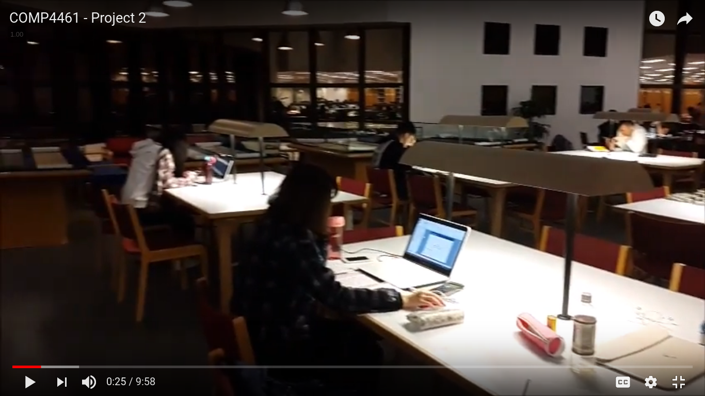](https://kp-kepra.github.io/comp4461diary/p2/observe2.png)

The first part, or needfinding, is divided into three parts : observation, interviews, and surveys. The observation was done in LG4 Library in HKUST at night time (around 7-8 pm) where students were studying under the lights from each of the tables. The observation was done in this place as it allowed for a better understanding of the lighting conditions the students used while studying, particularly under bright desk lamps. It was also the time where midterms were frequent so the observation during this time also captured decent amount of footage of students studying in LG4 Library.

[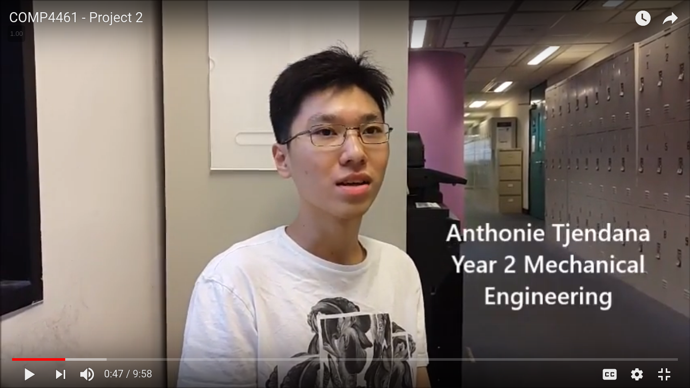](https://kp-kepra.github.io/comp4461diary/p2/anton1.png)
[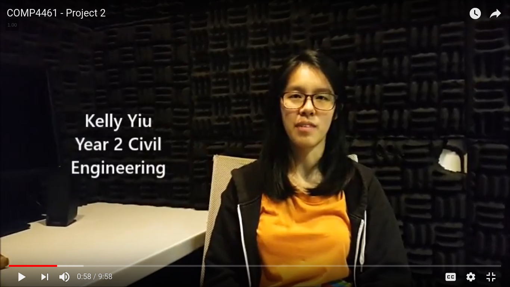](https://kp-kepra.github.io/comp4461diary/p2/kelly1.png)
[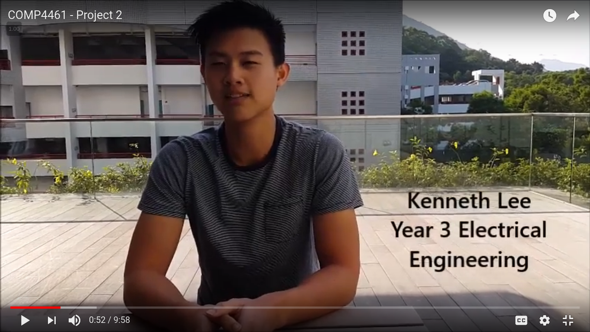](https://kp-kepra.github.io/comp4461diary/p2/kenneth2.png)

To get a much clearer understanding of what people think about the lighting condition problem, an interview was made with three students of HKUST with varying majors and backgrounds. The questions asked during the interview were mostly about how the students use their daily lighting for daily use (e.g. studying, sleeping, etc) and what do they like and dislike about it. In this interview that I did, most of the respondents answered that they mostly don't like having to walk across the room to just switch off the lights, and they can only have a fixed lighting, meaning that they cannot adjust the brightness nor the intensity of the lights.

The interview then continued on how they would like to implement their own lighting system. The most common answer is that the respondents would like to set their own color, brightness and saturation, which in turn, can help boost their productivity while studying, sleeping, and other activities according to their mood. For example, one interviewee answered that she would sleep more easily if the lighting gradually changes color to red before sleeping.

A survey was also conducted to gather information about general preferences of room lighting, and how people would use in their daily life. This survey asked some common questions to further support the opinions from the interviews and add some perspective to the observations.

[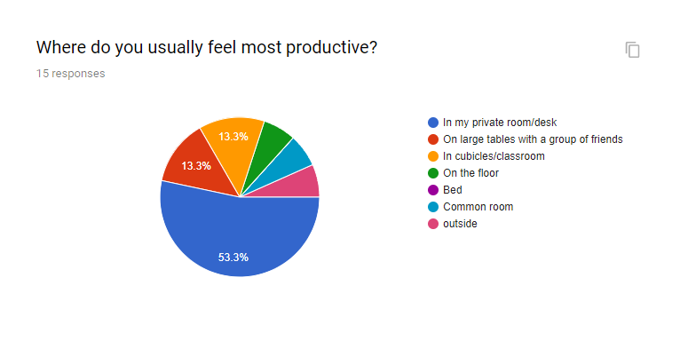](https://kp-kepra.github.io/comp4461diary/p2/survey1.png)
[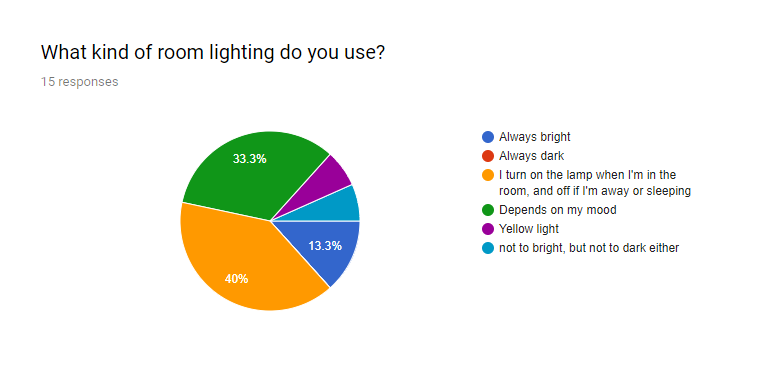](https://kp-kepra.github.io/comp4461diary/p2/survey2.png)
[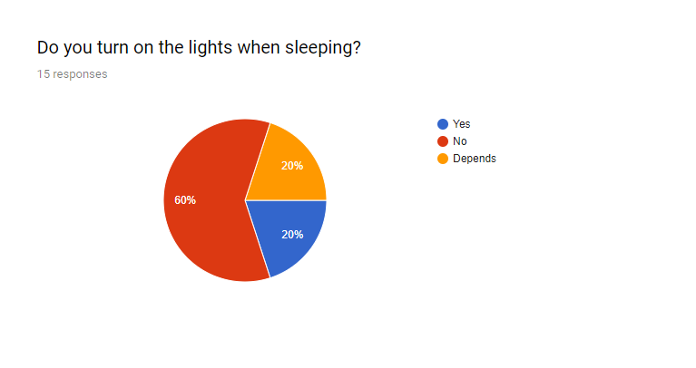](https://kp-kepra.github.io/comp4461diary/p2/survey3.png)
[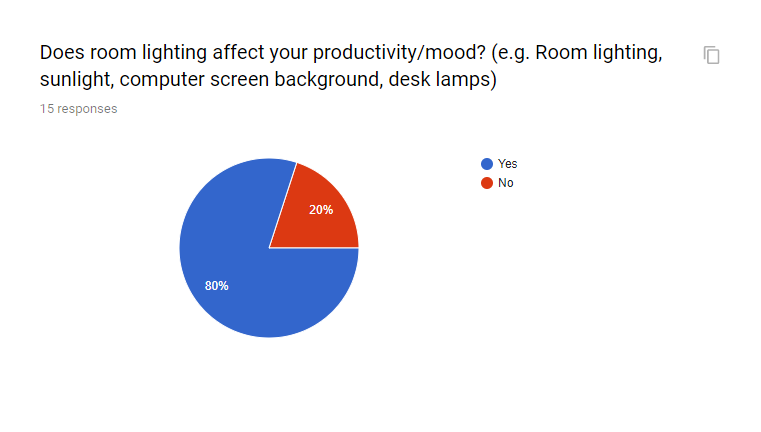](https://kp-kepra.github.io/comp4461diary/p2/survey4.png)
[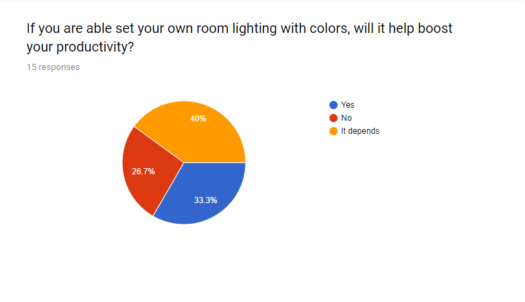](https://kp-kepra.github.io/comp4461diary/p2/survey5.png)
[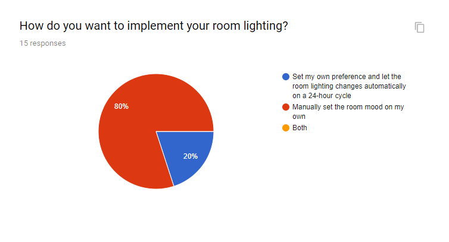](https:/i/kp-kepra.github.io/comp4461diary/p2/survey6.png)
> Survey results. Click on the images to enlarge.

## Part 2 - Idea Brainstorming & Validation
---

[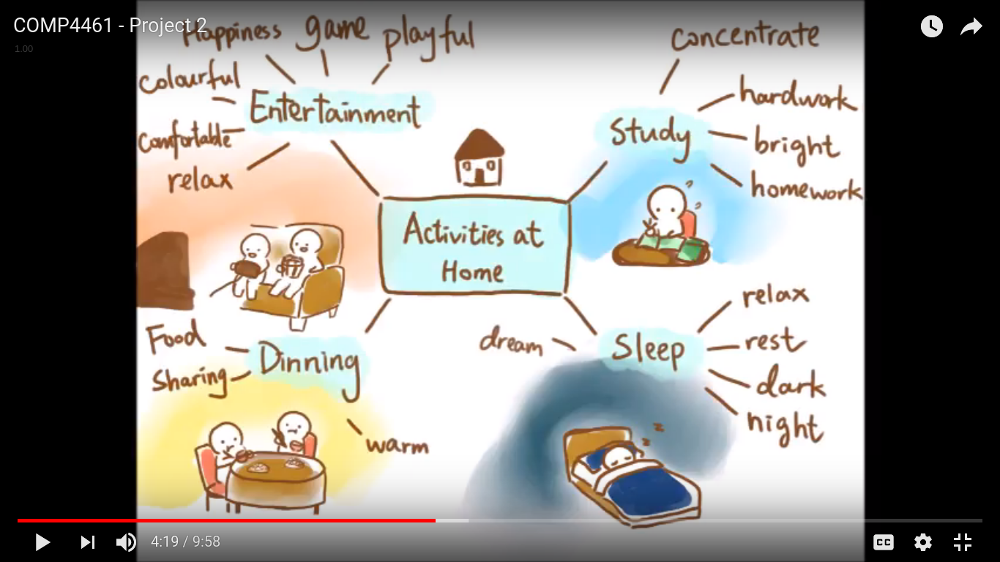](https://kp-kepra.github.io/comp4461diary/p2/pov.png)
[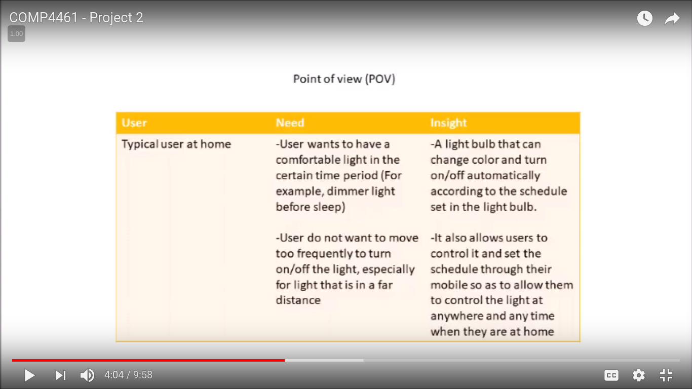](https://kp-kepra.github.io/comp4461diary/p2/pov2.png)

Initially the idea was to make a simple smartphone app that enables user to connect to the hue bridge and controls the lights using the app. However, due to tight schedule, the idea was later improvised to use a server that runs 24 hours a day, in which the program can run and controls the light system. The implementation of the idea later proved to be lightweight and doesn't require a lot of code implementation, while still enabling the users to use the dashboard in an instant.

After the basic idea was done, the idea was then proposed again to the interviewees to ask what they think of the initial idea. Most of the respondents gave positive feedbacks, noticed how a 24-hour dashboard will definitely help them control the lights at ease. The respondents also replied that the app may be better with additional features such as allowing them to set up a 24-hour schedule to automatically control the lights, setting up their own room lighting to change several lights at once, and many others.

## Part 3 - Prototype Design
---

[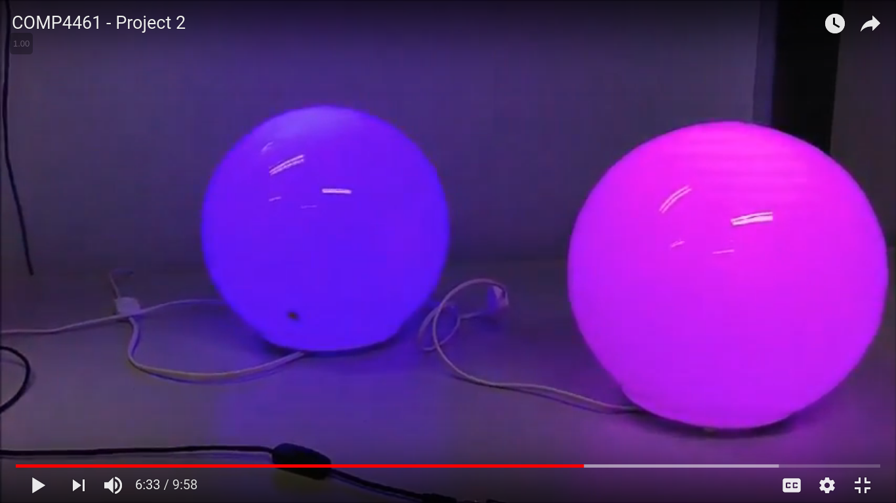](https://kp-kepra.github.io/comp4461diary/p2/prototype1.png)
[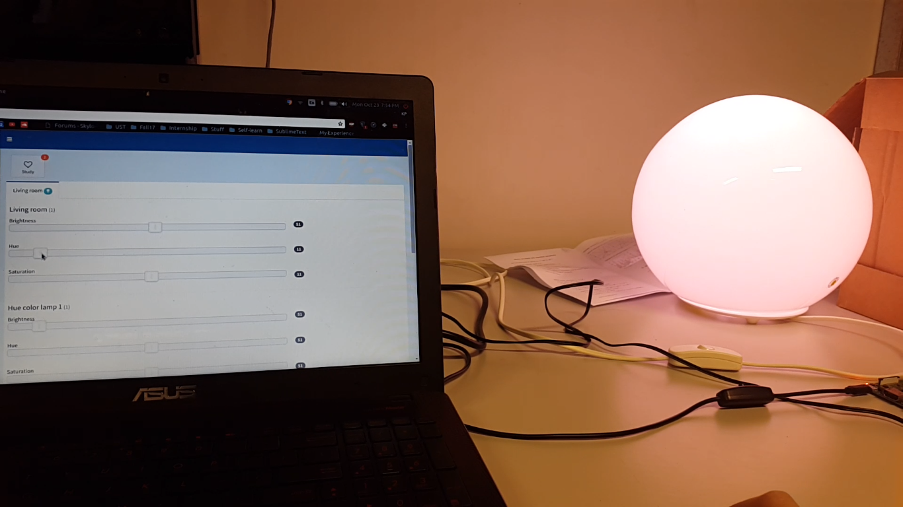](https://kp-kepra.github.io/comp4461diary/p2/prototype1.png)
[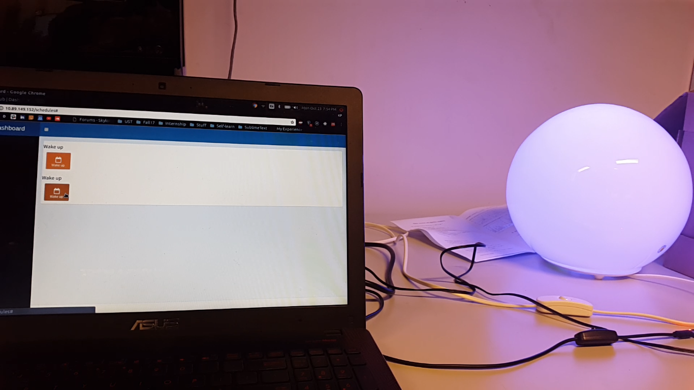](https://kp-kepra.github.io/comp4461diary/p2/prototype1.png)
> Phillips Hue connected to the server app in Raspberry Pi

The prototype itself was made using the Raspberry Pi and a server program that connects to the Hue Bridge within the same network. The Raspberry Pi acts as the automation server which ideally would run 24 hours a day. This allows for a lower power consumption, while still enabling users to set their custom lighting and automate their light schedules. The server program is then loaded into the SD Card inside the Raspberry Pi and executed to the port 80. This kind of configuration enables the Raspberry Pi's IP Address to be accessed using any device within the same network.

The server program itself is made in Python language using Flask library for server features. The code I made was based on the original boilerplate which can be found in this link (https://github.com/jcalais/huedash). However, the program itself was limited to changing the brightness of the light. Hence, several changes were made and added to the program, resulting in the final prototype where the user can control all the three lights, plus changing the brightness, saturation, and colors of each light. Another feature was added to display available schedules within a certain user on the Hue Bridge, and allows the user to enable/disable the schedule. If the schedule is enabled, it will trigger the lighting scene change at a certain time.

The program itself is also mobile-compatible from the original boilerplate, hence the server can also be accessed from smartphones and lights can be changed at ease. Several features were also in consideration during the development process, including sorting the schedule blocks when the user wants to rearrange the light schedule, add/remove the scene or schedules with buttons. However, due to time constraints, the program was only able to change the lights manually and display available schedules at the moment.

Finally, a user demonstration and feedback was conducted involving one of the interviewees. In this demonstration, the user is required to open the browser and navigate to the server app, and try changing the lights using the sliders in the app. Then the user is required to set the schedule enabled which is set 20 seconds from the moment the button was pressed. The user was then asked to give feedback of the overall implementation of the server. The feedback involved about the responsiveness of the server, the problems he faced including several features that were yet to be added (e.g. functions to give suggestions about room lighting condition at a certain time based on user's use).

## Part 4 - Making the video
---
The video itself was made with Windows Live Movie Maker. Perhaps this part is the most time-consuming one, as it requires a lot of video and audio cuts, music timings, and texts added into the video. But, the overall progress in this part went pretty smooth as the raw videos were all already recorded. 

[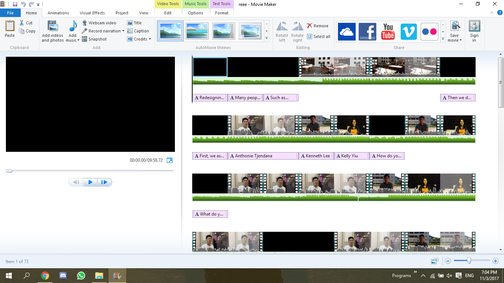](https://kp-kepra.github.io/comp4461diary/p2/video.png)
> The video project file

[Link to the video](https://youtu.be/MewN1Z8aMPU)

## Part 5 - Conclusion
---
In the end, I learned a lot of things from the very start to the end. I learned on how to not only make a product or application, but also to actually connect the product's use to the users' needs. Perhaps this is the most prominent thing I've came across while doing the project, finding the needs of the users and with it, a solution along with its implementation to meet their needs.

On the other side, I also learned on how to conduct casual but contentful interviews with students in HKUST, along with the knowledge of setting up a Raspberry Pi to run the smartlight automation server for daily home use.