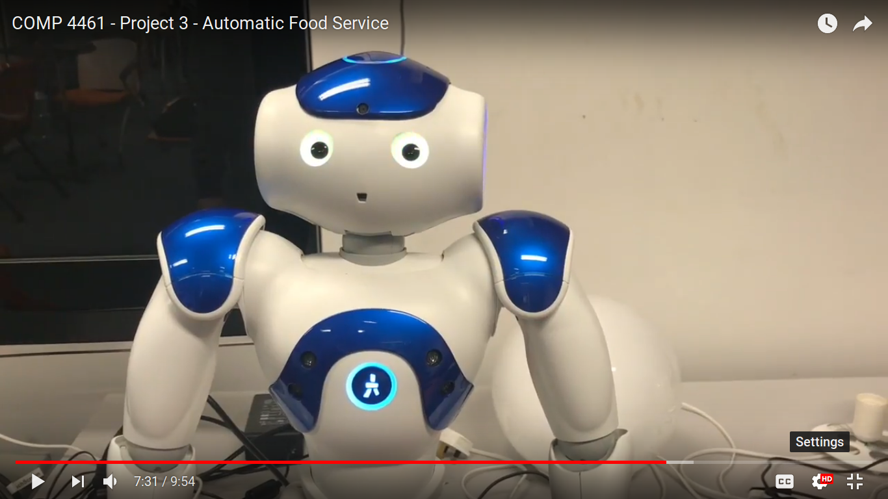

# Project 3 Diary - Human Robot Interaction with NaoRobot

## Part 1 - Needfinding (Observation and Interview)
---

> Observation in 20x speed at McDonald's line.

In the needfinding of this project, we decided to narrow down to two parts : observation and interviews. We feel that these two needfinding methods are effective in helping us finding the problem and demands that users usually need. The observation was done in LG5 McDonald's queue at evening (around 6pm). We thought it was the best time to do the recording as the queue was pretty long and may take up to 10-15 minutes before a customer could make orders. In this part, the whole video was sped up 20 times for the viewers to get a more holistic view of how time consuming a queue in crowded restaurants like McDonald's can be.

The observation was then supplemented with interviews conducted to some of the students in UST. This was done in order to enhance our understanding of the current problem people are facing in their daily lifes, notably the long lines of restaurants. Mostly we asked questions that demand personal views about the students' experience and feelings while queueing at McDonald's. Most of the respondents answered they usually have to take around 15 to 20 minutes, and the queue line can be really long, up to the side of Students Union Co-Op Shop.

We then asked their opinion if we implemented a robot which can receive orders via speech recognition, and then the employees can use the time more efficiently to prepare and serve the food to the customers. The idea mostly received positive responses from different students. They straightforwardly stated that sometimes it is frustrating to wait in McDonald's queue for a  long time before they actually can make the order. 

## Part 2 - Idea Brainstorming and Speed Dating
---

> Brainstorming ideas on mindmap diagram

As our idea was pretty much set and solid from the start, we started to make the brainstorming process through mindmap diagram. Mostly we bounced ideas from one to the other about the pros and cons of our idea, how it would be beneficial to the customers lining up in restaurants, and speed up the employees' work. Then we drew the final mindmap diagram which made into the final cut of the video. The diagram also mentioned how a robot can be more interactive for customers' experience while ordering food.

We also made a storyboard and Point-of-View, to help us understand the idea if we were in the customers' shoes. The storyboard was made with a simple storyboarding app online, with the general idea explaining the implementation and result of our idea. According to the storyboard, the user can greet the robot and make orders based on the menu available, and then state whether the user wants another order. If no, the user can then tap the Octopus and tap the tactile sensor on the robot's head, and finally proceed with receiving the bill and wait for the order.

> Speed dating with other two students in UST.

This idea was then proposed to another set of students mentioned in Part 1. One of the student asked how exactly the robot would be placed at the cashier. He also asked how the implementation would be more beneficial compared to automatic touchscreen ordering system. Definitely most of these questions helped us polish our ideas and make sure that there were no drawbacks in implementing our food ordering system.

> Big Shaq as the fictional character in our Point of View

Finally, besides of asking others' opinions about our ideas, we also made a fictional character based on the recently famous British comedian in his character, Big Shaq. Aside from the jokes we put in the video, we found new details that the user may experience when facing long queues when ordering food, such as language barrier as some people can't speak Cantonese, and users can actually use the time besides waiting for more productive activities (studying or doing projects).

## Part 3 - Prototype Design
---

> Making the program in NaoRobot using Choregraphe

The prototype design itself is made with the Choregraphe app downloaded from the Softbank Robotics's website, with Nao V5 Software Development Kit. Mostly we used the built-in features of the applicationto provide functionalities to the robot itself, such as speech recognition and basic gestures. Initially it took a while for us to figure out the components and how they work with each other. We started with the 'Hello' gesture and a command saying the word 'Hello'. Then we figured out the connections (notably, the output types and input conditions) for each component, and we were able to make a simple procedure where the robot can receive orders via speech recognition, and the Octopus payment procedure via tactile sensor input located on its head.

We also encountered some problems in the process of making the procedure. There weren't a lot of gesture options initially for the NaoRobot itself, so we had to search gestures online which were already made by some universities on their website. The gesture we searched was the bow gesture used by the robot towards the end of the procedure while stating that the user can take the bill before proceeding to the next customer. 

Another problem we encountered was that the robot couldn't recognize the voice or it recognized words too loosely. Hence, it resulted in wrong outputs we wanted. For example, we had to adjust the recognition threshold when the robot accepts the word 'No' as 'Hello'. We had to tune the threshold values and test the program multiple times before we had the result that we want.

## Part 4 - Usability Testing and Revisions
---

> Usability testing

The usability testing was also rather important and helpful because it notified us the further bugs and errors of the program. The most prominent problem that appeared while other groups were testing was that when the program couldn't recognized voices from the user, the exceptions were still unhandled. As a result, the program crashes and we had to reupload the program for use again. This proved to be troublesome as the user couldn't had a full, smooth experience of using the robot for food ordering system.

Straight after the final group testing, we proceeded on to fix the unhandled errors. It turned out we connected the wrong components in our program. The revision took a rather long amount of time after the class but then we figured it out and were able to make a more smooth and functional program. We also added the record of our usability testing in the final video.

## Part 5 - Conclusion
---

As a conclusion, although there were a lot of jokes in the video, but I enjoyed working in the final project. I was able to learn more and new things in this project, notably how a robot can actually be useful in our daily life. Before, I wasn't able to figure out myself how a robot would be really helpful in human interaction. But, after doing the project, I found many things that when applied in the right place and the right time, a robot interaction can be really useful to help our lives better.

My personal contribution to the team would be conducting interviews and speed datings with students, alongside with Kristian. I also helped Kan in the making of most of the video, also with Kristian while making the program for the robot, making sure everything was working correctly.